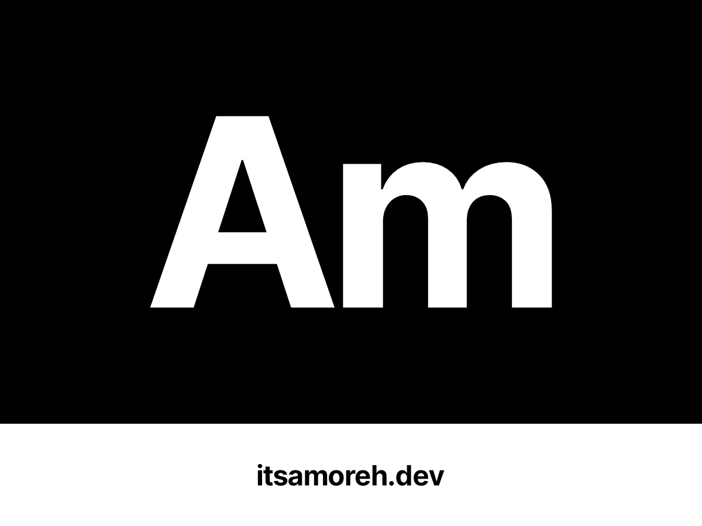

# itsamoreh.dev WordPress block theme



## What is this?

This is the WordPress block theme in use on my personal website (itsamoreh.dev](https://itsamoreh.dev).

This theme was started from [itsamoreh/block-theme-starter](https://github.com/itsamoreh/block-theme-starter).

## Quick Start

1. Make sure you're on node version `18.12.1` or later.
1. Run `npm install` from this directory to install dependencies.
1. Run `npm run watch` to watch [CSS](#css), and [JavaScript](#editor-and-frontend-javascript).
1. Optionally follow the [local environment](#optional-local-environment)
   instructions below to spin up a wp-env environment.

## CSS

This theme uses PostCSS to process CSS. The main CSS entrypoint is
`assets/main.css`. All CSS with be compiled to `style.css` which is enqueued in
`functions.php` **for both the editor and the frontend**.

To build the CSS, run the following command in your terminal:

```bash
npm run build:css
```

This will take the `assets/main.css` file, run it and all imports through
PostCSS, and output the result to style.css. To watch for changes to your CSS
and automatically rebuild, run the following command in your terminal:

```bash
npm run watch:css
```

## Editor and Frontend JavaScript

This theme uses wp-scripts to build editor and frontend JS. The main editor
entry is at `assets/js/editor/index.js` and the main frontend entry is at
`assets/js/frontend/index.js`.

To build the JS, run the following command in your terminal:

```bash
npm run build:js
```

This will take the entry files, build them and all imports with wp-scripts, and
output the files to `build/editor.js` and `build/frontend.js`. To watch for
changes to your JS and automatically rebuild, run the following command in your
terminal:

```bash
npm run watch:js
```

## Optional Local Environment

This theme includes a `.wp-env.json`. To spin up a WordPress environment with
`wp-env` first make sure
[Docker](https://www.docker.com/products/docker-desktop/) is installed.
Then run the following command to start the environment:

```bash
npm run env:start
```

You can stop the environment with Docker Desktop or the stop command:

```bash
npm run env:stop
```

See the
[wp-env documentation](https://developer.wordpress.org/block-editor/reference-guides/packages/packages-env/#installation)
for more details.
